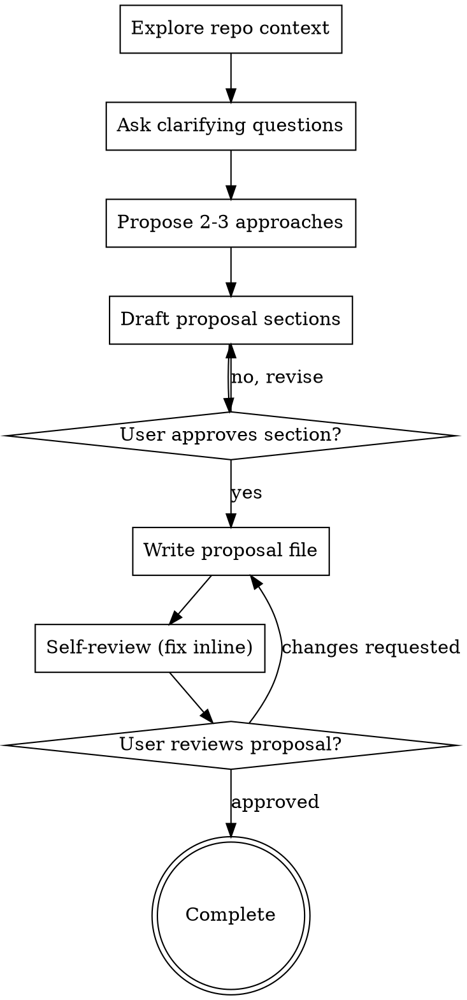

# Propose Skill

Create proposal docs that match this repository's accepted style and workflow through systematic discovery and validation.

## Hard Gate

Do NOT write the proposal document until you have:
1. Explored the context
2. Asked clarifying questions
3. Presented approaches and gotten alignment
4. Drafted the proposal sections with approval

This applies to ALL proposals regardless of perceived simplicity.

## Anti-Pattern: "This Is Too Simple To Need Discovery"

Every proposal goes through this process. A small tool addition, a documentation change, a schema tweak — all of them. "Simple" proposals are where unexamined assumptions cause the most rework. The discovery can be brief for truly simple work, but you MUST do it.

## When to use

Use this skill when:
- the user asks for a new proposal in `propose/active/`
- the user asks to refine an existing proposal
- work is non-trivial and should be proposed before implementation
- the user asks "should we propose this first?"

Do not use this skill for small one-file bug fixes or purely mechanical edits.

## Handoff to `plan`

If the work is expected to ship as multiple implementation PRs, create/update
the proposal here first, then hand off plan authoring to
`../plan/SKILL.md` for the execution split and per-PR delivery contract.

## Checklist

You MUST create a task for each of these items and complete them in order:

1. **Explore repo context** — check README.md, CODEBASE_REQUIREMENTS.md, relevant existing proposals, recent commits
2. **Ask clarifying questions** — one at a time, determine what to ask based on context and topic. Focus on understanding the real problem, constraints, success criteria
3. **Propose 2-3 approaches** — with trade-offs and your recommendation
4. **Draft proposal sections** — present each section and get approval before moving to the next
5. **Write proposal file** — save to `propose/active/<TOPIC>-PROPOSE.md`
6. **Self-review** — check for quality issues inline
7. **User review gate** — ask user to review the written proposal
8. **Complete** — mark proposal ready for implementation planning

## Process Flow



## The Process

**1. Explore repo context:**

Before asking anything, read:
- `README.md` — public surface, env vars, ontology/reindex implications
- `CODEBASE_REQUIREMENTS.md` — brownfield assumptions and source mapping
- Relevant existing proposals under `propose/active/`
- Recent commits in the target area

**2. Ask clarifying questions:**

Ask questions ONE AT A TIME to refine the proposal. You determine what to ask based on:
- What you don't understand about the problem
- What seems ambiguous or underspecified
- What alternatives exist
- What constraints or dependencies matter

**Prefer multiple choice questions when possible, but open-ended is fine too.**

Only one question per message. If a topic needs more exploration, break it into multiple questions.

Focus on understanding:
- The real problem (vs symptoms)
- Success criteria
- Constraints and dependencies
- What's explicitly out of scope

**3. Propose approaches:**

Once you understand the problem space, present 2-3 different solution approaches:
- Lead with your recommended option and explain why
- Include trade-offs for each option
- Be specific about what each approach means

Present options conversationally. Wait for user alignment before proceeding.

**4. Draft proposal sections:**

Once aligned on an approach, draft the proposal section by section:
- Present each section and ask "Does this look right?"
- Wait for approval before moving to the next section
- Scale sections to complexity: a few sentences if straightforward, more detail if nuanced

**5. Write the proposal file:**

After section approval, write the complete proposal to `propose/active/<TOPIC>-PROPOSE.md`

Use the standard structure (below) adapted to the topic's complexity.

**6. Self-review:**

Immediately after writing the proposal, review it for:
1. **Placeholder scan:** Any "TBD", "TODO", incomplete sections, or vague statements? Fix them.
2. **Internal consistency:** Do sections contradict each other? Does the scope match the proposed solution?
3. **Quality bar check:** Does it meet the quality criteria below?
4. **Ambiguity check:** Could anything be interpreted two different ways? Pick one and make it explicit.

Fix any issues inline. No need to re-review — just fix and move on.

**7. User review gate:**

After self-review passes, ask the user:

> "Proposal written to `propose/active/<TOPIC>-PROPOSE.md`. Please review it and let me know if you want any changes before we proceed."

Wait for the user's response. If they request changes, make them and re-run the self-review loop. Only mark complete once the user approves.

## Proposal quality bar (based on merged PR patterns)

Strong proposals in this repo consistently do the following:
- state **Status** up front (proposal only, not implementation)
- define a crisp **Problem Statement** with concrete failure modes
- include a concrete **Proposed Solution** with explicit scope boundaries
- call out **Schema / ontology / re-index impact** explicitly
- include **Open questions** with `[TBD]` items and recommended defaults
- include **Out of scope** to avoid accidental scope creep
- include **Sequencing** and dependencies when multi-PR work is expected
- include a lightweight **test/validation strategy** even for docs-only PRs

## Standard propose structure

Use this structure by default (adapt section names only when needed):

```markdown
# <TOPIC TITLE>

## Status
Proposal — not yet implemented.

## Problem Statement
<What is broken/missing, and why it matters now. Include concrete examples.>

## Proposed Solution
<Core design, API/schema behavior, decision points.>

## Scope
<What this proposal changes.>

## Schema / Ontology / Re-index impact
- Ontology bump: <required or not required>
- Re-index required: <yes/no and why>
- Config/tool surface changes: <list or "none">

## Tests / Validation
<How correctness will be validated once implemented.>

## Open Questions ([TBD])
1. <Question> — Recommended: <option>
2. <Question> — Recommended: <option>

## Out of scope
- <Explicit non-goals>

## Sequencing / Follow-ups
<PR split, dependencies, or "single PR".>
```

## Writing rules

- Prefer explicit, testable statements over aspirational language.
- Keep terminology consistent with `java_ontology.py` and README terms.
- If behavior changes user-facing tools, mention exact tool names and fields.
- If semantics change, state ontology bump and re-index requirement plainly.
- If this is a design-only PR, clearly say no production code changed.
- Never propose compatibility shims unless explicitly requested.

## PR body template for propose-only changes

When opening the PR, use this compact shape:

```markdown
## What
<Added/updated proposal file(s).>

## Why now
<Urgency and context.>

## Highlights
- <3-6 key points>

## Tests
Docs-only; baseline unchanged.

## Out of scope
- <Implementation deferred>
```

## File naming

- Use uppercase kebab-style topic names ending in `-PROPOSE.md`.
- Keep names specific to the decision, e.g.:
  - `FEATURE-NAME-PROPOSE.md`
  - `TOOL-NAME-PROPOSE.md`
  - `ARCHITECTURE-CHANGE-PROPOSE.md`

## Key Principles

- **One question at a time** — Don't overwhelm with multiple questions
- **Multiple choice preferred** — Easier to answer than open-ended when possible
- **Agent determines questions** — You figure out what to ask based on context
- **Explore alternatives** — Always propose 2-3 approaches before settling
- **Incremental validation** — Present sections, get approval before moving on
- **Be flexible** — Go back and clarify when something doesn't make sense

## Key Principles

- **One question at a time** — Don't overwhelm with multiple questions
- **Multiple choice preferred** — Easier to answer than open-ended when possible
- **Agent determines questions** — You figure out what to ask based on context
- **Explore alternatives** — Always propose 2-3 approaches before settling
- **Incremental validation** — Present sections, get approval before moving on
- **Be flexible** — Go back and clarify when something doesn't make sense

## Additional resources

- See practical examples in [reference.md](reference.md).
- See a repo-grounded golden sample in [examples.md](examples.md).
